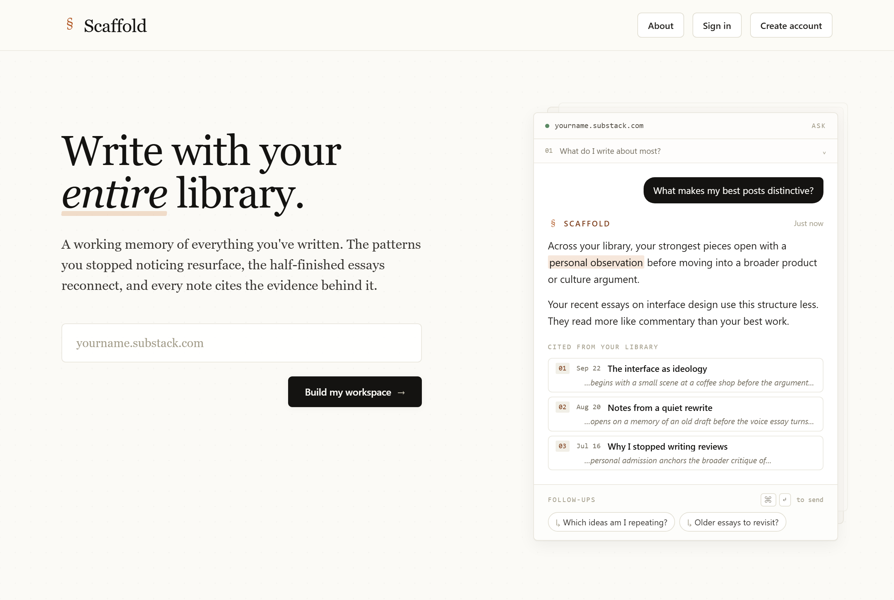

# Scaffold

Write with your entire library. Scaffold turns a publication's public posts into a private library a writer can question, search and write against, with every answer citing the posts behind it.

Live: [scaffold.aviralagarwal.com](https://scaffold.aviralagarwal.com)



A writer with years of essays cannot hold all of them in mind, and a general chatbot knows none of them. Scaffold reads a publication's RSS feed, keeps every post it has seen even after it scrolls out of the feed, and answers from that library, pointing back to the exact passages it used.

## Features

- Email and password accounts with verification and password reset.
- One workspace per publication. Paste a homepage that serves a feed at `/feed`, such as a Substack or WordPress site, and Scaffold builds the library and its recurring themes.
- **Conversation**: ask the library questions; answers cite the passages they draw on.
- **Feedback**: a reading of a new draft against the voice and structure of the published work.
- **Notes**: annotate passages in your own posts.
- **Promotion**: drafts adapted from a post for social platforms. It prepares them; it does not publish.
- **Exploration**: ideas developed from recurring themes.
- **Search**: find a half-remembered line across every post.
- **Library**: browse, resync and export the posts.
- Monthly token budgets per account, checked before every model call and recorded after it.
- A free Basic plan and a Premium subscription through Stripe Checkout, Customer Portal and webhooks.

## Stack

- Next.js App Router, React 19 and TypeScript, styled with Tailwind CSS.
- Postgres through Drizzle ORM and Drizzle Kit migrations.
- NextAuth credentials sessions; email through Resend.
- Anthropic's API, called server-side only through one metered gateway. Retrieval is lexical, with no vector store.
- RSS read with Node's `fetch`, identifying itself as `Scaffold/0.1`. A feed that refuses the request, usually through bot protection, is reported as refused, not retried under a browser's identity.
- Stripe over its REST API, without the SDK.
- Docker, deployed to Google Cloud Run by GitHub Actions.

## Getting started

You need Node 22 and a Postgres database ([Neon](https://neon.tech) works).

1. **Install**

   ```bash
   npm ci
   ```

2. **Configure**

   ```bash
   cp .env.example .env
   ```

   [`.env.example`](.env.example) lists every variable with comments. `DATABASE_URL` and `NEXTAUTH_SECRET` are required. The rest are optional locally:

   - Without `ANTHROPIC_API_KEY`, the tools still answer, from matching excerpts and templates instead of generated text.
   - Without `RESEND_API_KEY`, verification and password-reset links are printed to the server log instead of emailed.
   - Without the Stripe variables, everything works on the Basic plan and upgrading reports that Stripe is not configured. Use Sandbox keys to test billing.

3. **Migrate and run**

   ```bash
   npm run db:migrate
   npm run dev
   ```

   Open [http://localhost:3000](http://localhost:3000), create an account and follow the verification link from the server log.

## Tests

```bash
npm run check:static   # copy audit and node:test suites; this is what CI runs
npm run check          # the same, then a production build
npm run typecheck
```

None of these touch a database. The copy audit enforces the product vocabulary in [`lib/copy.ts`](lib/copy.ts).

## Deploying

The `Dockerfile` builds a standalone Next.js server that listens on `$PORT`, which suits Cloud Run and most container hosts. Set the same environment variables on the service, and point a Stripe webhook at `/api/billing/webhook`.

`.github/workflows/deploy.yml` builds and deploys on every push to `main`. Its Google Cloud identity trusts only this repository, so in a fork it does nothing; change the project, region, service and identity settings for your own, or delete it. Before deploying, it runs a read-only check that every migration has been applied to the production database. `scripts/check-cloud-run-env.mjs` then compares the live service's environment with the values it expects, which are the maintainer's.

The site URL in `app/robots.ts` and `app/sitemap.ts` is hardcoded to the maintainer's domain.

The service is pinned to one instance because the library is stored as one JSON document in Postgres and rate limits are kept in memory.

## Project layout

```text
app/            Routes: each page or API handler at its URL
components/     UI grouped by surface: workspace, account, auth, marketing, shell, ui
lib/client/     Browser helpers
lib/server/     Server services: model gateway, corpus store, retrieval, auth, billing, fetch guard
lib/copy.ts     Product vocabulary and shared copy
types/          The contract between client and server
drizzle/        Migrations generated from lib/server/db/schema.ts
scripts/        Command-line checks run from package.json
tests/          node:test suites
```

## License

MIT. See [LICENSE](LICENSE).
